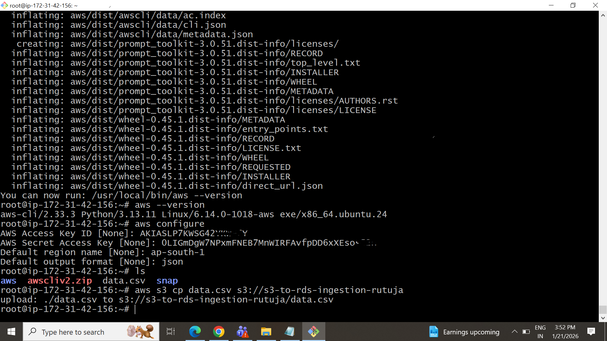

# Data Ingestion from S3 to RDS with Fallback to AWS Glue using Dockerized Python

## Author
Rutuja Patil

---

## Objective
This project demonstrates a fault-tolerant data ingestion pipeline that:
- Reads CSV data from Amazon S3
- Pushes it into an Amazon RDS (MySQL-compatible) database
- Falls back to AWS Glue Data Catalog if the RDS upload fails
- Runs inside a Docker container

---

## Architecture

S3 Bucket (CSV)
      ↓
Dockerized Python App
      ↓
RDS MySQL (Primary)
      ↓ (If fails)
AWS Glue Data Catalog (Fallback)

---

## AWS Services Used
- Amazon S3
- Amazon RDS (MySQL)
- AWS Glue
- IAM
- Docker

---

## Project Structure

s3-rds-glue-project/
│
├── ingest.py
├── Dockerfile
├── requirements.txt
└── README.md

---

## Step 1: AWS Setup

### 1. Create S3 Bucket
Upload a CSV file.

Example: data.csv

```
id,name,age,city
1,Mansi,25,Pune
2,Dhiraj,24,Mumbai
3,Sneha,23,Nagpur
```

---


### 2. Create RDS MySQL Database
- Engine: MySQL
- DB Name: testdb
- Username: admin
- Password: password
- Public Access: Yes

---

### 3. Create Glue Database
Go to AWS Glue → Databases → Create Database

Name: mydb

---

### 4. IAM Permissions Required
- AmazonS3FullAccess
- AmazonRDSFullAccess
- AWSGlueConsoleFullAccess

---

## Step 2: Python Script (ingest.py)

```python
import boto3
import pandas as pd
from sqlalchemy import create_engine
import os

S3_BUCKET = os.getenv("S3_BUCKET")
S3_KEY = os.getenv("S3_KEY")

RDS_HOST = os.getenv("RDS_HOST")
RDS_USER = os.getenv("RDS_USER")
RDS_PASSWORD = os.getenv("RDS_PASSWORD")
RDS_DB = os.getenv("RDS_DB")
RDS_TABLE = os.getenv("RDS_TABLE")

GLUE_DB = os.getenv("GLUE_DB")
GLUE_TABLE = os.getenv("GLUE_TABLE")
GLUE_S3_LOCATION = os.getenv("GLUE_S3_LOCATION")

AWS_REGION = os.getenv("AWS_REGION", "us-east-1")

def read_from_s3():
    print("Reading file from S3...")
    s3 = boto3.client("s3", region_name=AWS_REGION)
    obj = s3.get_object(Bucket=S3_BUCKET, Key=S3_KEY)
    df = pd.read_csv(obj["Body"])
    print("S3 file read successfully")
    return df

def push_to_rds(df):
    try:
        print("Trying to push data to RDS...")
        engine = create_engine(
            f"mysql+pymysql://{RDS_USER}:{RDS_PASSWORD}@{RDS_HOST}/{RDS_DB}"
        )
        df.to_sql(RDS_TABLE, con=engine, if_exists="append", index=False)
        print("Data successfully inserted into RDS!")
        return True
    except Exception as e:
        print("RDS upload failed:", e)
        return False

def fallback_to_glue(df):
    print("Falling back to AWS Glue...")
    glue = boto3.client("glue", region_name=AWS_REGION)

    try:
        glue.create_table(
            DatabaseName=GLUE_DB,
            TableInput={
                "Name": GLUE_TABLE,
                "StorageDescriptor": {
                    "Columns": [{"Name": col, "Type": "string"} for col in df.columns],
                    "Location": GLUE_S3_LOCATION,
                    "InputFormat": "org.apache.hadoop.mapred.TextInputFormat",
                    "OutputFormat": "org.apache.hadoop.hive.ql.io.HiveIgnoreKeyTextOutputFormat",
                    "SerdeInfo": {
                        "SerializationLibrary": "org.openx.data.jsonserde.JsonSerDe",
                        "Parameters": {"serialization.format": "1"}
                    }
                },
                "TableType": "EXTERNAL_TABLE"
            }
        )
        print("Glue table created successfully!")
    except glue.exceptions.AlreadyExistsException:
        print("Glue table already exists!")

def main():
    df = read_from_s3()
    success = push_to_rds(df)
    if not success:
        fallback_to_glue(df)

if __name__ == "__main__":
    main()
```

---

## Step 3: requirements.txt

```
boto3
pandas
sqlalchemy
pymysql
```

---

## Step 4: Dockerfile

```Dockerfile
FROM python:3.11-slim

WORKDIR /app

COPY requirements.txt .
RUN pip install --no-cache-dir -r requirements.txt

COPY ingest.py .

CMD ["python", "ingest.py"]
```

---

## Step 5: Build Docker Image

```
docker build -t s3-rds-glue .
```

---


## Step 6: Run Docker Container

```
docker run \
-e AWS_ACCESS_KEY_ID=****** \
-e AWS_SECRET_ACCESS_KEY=********* \
-e AWS_REGION=ap-south-1 \
-e S3_BUCKET=s3-to-rds-ingestion-rutuja \
-e S3_KEY=data.csv \
-e RDS_HOST=mydb.chkec0mgun0i.ap-south-1.rds.amazonaws.com \
-e RDS_USER=admin \
-e RDS_PASSWORD=RUTUpatil \
-e RDS_DB=mydb \
-e RDS_TABLE=mydb \
-e GLUE_DB=mydb \
-e GLUE_TABLE=mydb \
-e GLUE_S3_LOCATION=s3://s3-to-rds-ingestion-rutuja/ \
s3-rds-glue

```

---

## Step 7: Output

### If RDS Works
```
Data successfully inserted into RDS!
```

### If RDS Fails
```
RDS upload failed
Falling back to AWS Glue...
Glue table created successfully!
```

---

## Step 8: Verification

### RDS
```
SELECT * FROM mydb;
```

### Glue
AWS Glue → Databases → fallback_db → Tables

---

## Challenges Faced
- IAM permission issues
- RDS connectivity
- Docker networking
- Glue API structure

---

## Conclusion
This project implements a reliable ETL pipeline with fallback using AWS and Docker.

---
